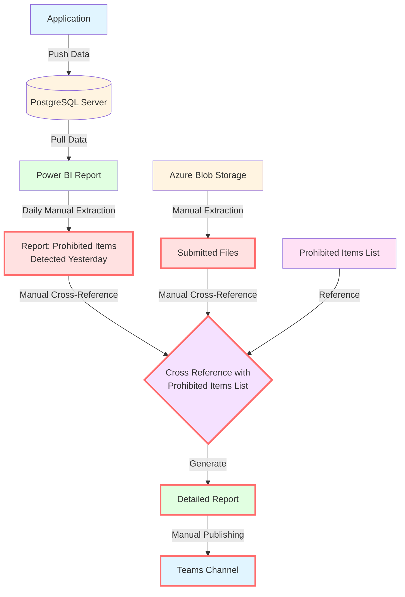
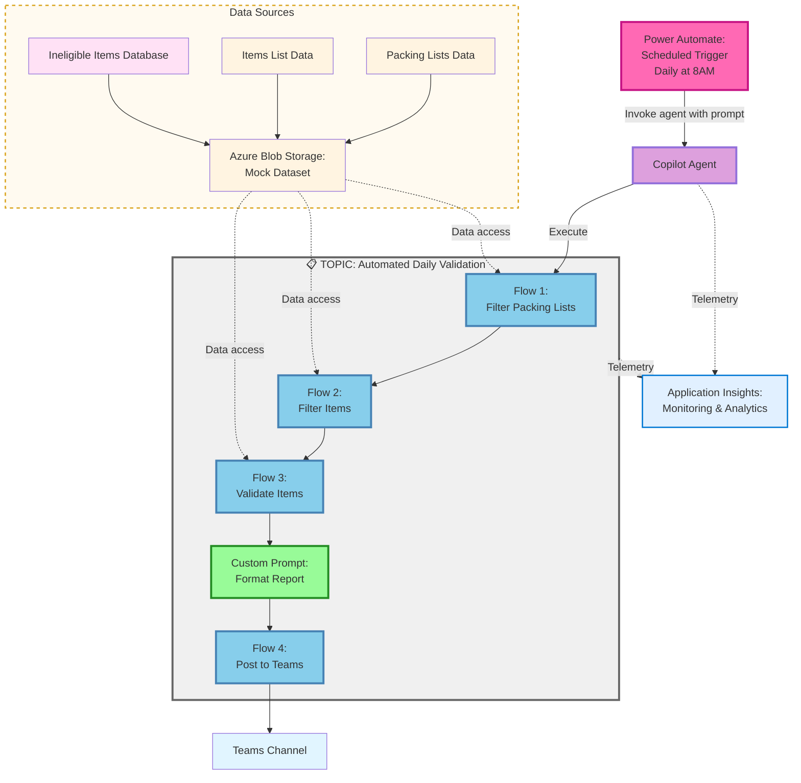
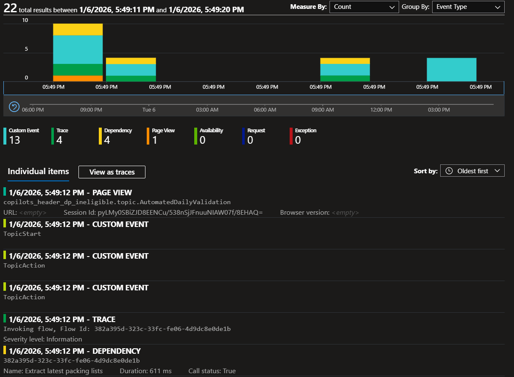

# Agentic Quality Validation and Reporting Framework

## Table of Contents

- [Current Challenge](#current-challenge)
- [Original Manual Workflow](#original-manual-workflow)
- [Why Automate This Workflow?](#why-automate-this-workflow)
- [Expected Benefits of Automation](#expected-benefits-of-automation)
- [Why a Generative AI Solution?](#why-a-generative-ai-solution)
- [Possible Technology Approaches](#possible-technology-approaches)
- [Recommended Technology Solution](#recommended-technology-solution)
  - [Why Microsoft 365 Copilot Custom Engine Agents?](#why-microsoft-365-copilot-custom-engine-agents)
  - [Hybrid Approach: Copilot Studio + Power Automate](#hybrid-approach-copilot-studio--power-automate)
- [Proof of Concept: Hybrid Automation Architecture](#proof-of-concept-hybrid-automation-architecture)
  - [Proof of Concept Approach](#proof-of-concept-approach)
  - [POC Design Decisions](#poc-design-decisions)
  - [Architecture Diagram](#architecture-diagram)
  - [Data Files Reference](#data-files-reference)
  - [Detailed Workflow Steps](#detailed-workflow-steps)
  - [Key Benefits of Hybrid Approach](#key-benefits-of-hybrid-approach)
  - [Monitoring and Observability](#monitoring-and-observability)
  - [POC Result Example](#poc-result-example)

---

## Current Challenge

Organisations use automated systems to detect prohibited items in submitted files for compliance and security. To ensure the detection system is working correctly, a quality assurance process monitors its outputs daily. Currently, this QA process involves multiple manual steps: extracting daily reports from Power BI showing items flagged by the system, manually retrieving the corresponding files from Blob Storage, cross-referencing everything against the prohibited items list to verify accuracy, generating detailed validation reports, and finally publishing findings to a Teams channel for review.

This is a temporary quality check process to validate that the automated detection system is performing as expected.

---

## Original Manual Workflow

The following diagram illustrates the current manual process for detecting and reporting prohibited items:

### Workflow Steps

1. **Data Ingestion**: Application pushes data to PostgreSQL server
2. **Reporting**: PostgreSQL data is pulled into Power BI report
3. **Manual Extraction**: Daily manual extraction of report showing prohibited items detected the previous day
4. **File Retrieval**: Manual extraction of corresponding submitted files from Azure Blob Storage
5. **Cross-Reference**: Manual cross-referencing of files and reports with prohibited items list to generate detailed report
6. **Publication**: Manual publishing of report to Teams channel

**Note**: Steps highlighted in red indicate manual intervention points that could be automated with custom agents.

---

## Why Automate This Workflow?

This manual process presents several critical challenges:

**Time-Intensive Operations**  
- Daily manual extraction from Power BI reports consumes significant staff time  
- Manual file retrieval from Azure Blob Storage is repetitive and error-prone  
- Cross-referencing files with prohibited items lists requires careful attention and is labour-intensive  
- On average, this process takes **1–2 hours every working day**, representing a recurring operational cost

**Consistency and Accuracy Concerns**  
- Manual processes are susceptible to human error  
- Inconsistent report formatting and potential for missed items  
- Variable quality depending on operator workload and fatigue

**Scalability Limitations**  
- Process doesn't scale well with increasing data volume  
- Manual steps create bottlenecks that delay reporting  
- Difficult to handle peak periods or urgent requests

**Operational Efficiency**  
- Staff time could be better utilised for analysis rather than data collection  
- Delays in report publication affect decision-making timelines  
- No ability to run on-demand or outside business hours

**Business Impact**  
Automating this workflow would free approximately **5–10 hours of staff time per week**, improve operational resilience by reducing dependency on specific individuals, and deliver a fast return on investment by removing repetitive manual effort from highly skilled personnel.

---

## Expected Benefits of Automation

**Improved Efficiency**
- Reduce processing time from hours to minutes
- Enable 24/7 automated operation without human intervention
- Free up staff for higher-value analytical work

**Enhanced Accuracy**
- Eliminate human error in data extraction and cross-referencing
- Ensure consistent application of prohibited items rules
- Standardised report formatting and completeness

**Better Timeliness**
- Automatic daily execution ensures reports are always current
- Potential for real-time or near-real-time reporting
- Immediate notification to stakeholders via Teams

**Scalability and Flexibility**
- Easily handle increased data volumes without additional resources
- Simple to modify rules or add new prohibited items
- Foundation for future enhancements and integrations

---

## Why a Generative AI Solution?

Generative AI enables intelligent report generation and data cross-referencing without rigid business logic. The solution uses LLM capabilities to:

- **Cross-reference data** between packing lists and prohibited items databases
- **Generate formatted reports** with natural language explanations
- **Adapt report formatting** based on findings (violations vs. clean reports)
- **Provide contextual feedback** in required table format

---

## Possible Technology Approaches

For comparison, the Microsoft documentation provides a comprehensive overview of development tool options:

| **Approach** | **Best For** | **Complexity** |
|---|---|---|
| **Copilot Studio** (Recommended) | Rapid development, low-code solutions, Teams integration | Low |
| **Microsoft 365 Agents SDK** | Multi-channel deployment, custom orchestration requirements | High |
| **Teams SDK** | Teams-specific collaborative scenarios | Medium |
| **Microsoft Foundry** | Existing AI logic in Foundry requiring Microsoft 365 integration | Medium-High |

For detailed comparison and technical specifications, refer to the [Microsoft 365 Custom Engine Agent documentation](https://learn.microsoft.com/en-us/microsoft-365-copilot/extensibility/overview-custom-engine-agent#agent-development-tool-comparison).

---

## Recommended Technology Solution

### Why Microsoft 365 Copilot Custom Engine Agents?

Given the requirements for this automation workflow, **Microsoft 365 Copilot custom engine agents** represent the most suitable technology approach, particularly due to their native integration with Microsoft Teams and the Microsoft 365 ecosystem.

**Why Not Declarative Agents?**

Whilst Microsoft 365 Copilot supports declarative agents, they are limited to single-task operations and are prone to hallucination when handling complex, multi-step workflows. Our use case requires:

- Sequential coordination between multiple agents
- Complex data processing and cross-referencing operations
- Reliable execution across multiple stages (collection, analysis, publication)

These requirements exceed the capabilities of declarative agents, making **custom engine agents** the appropriate choice for this solution.

### Hybrid Approach: Copilot Studio + Power Automate

For this proof of concept, a **hybrid approach using Copilot Studio and Power Automate** provides the optimal solution:

**Copilot Studio for AI Tasks**
- Custom prompts for natural language parsing and report generation
- Leverages LLM capabilities for unstructured text processing
- Ideal for formatting and generating human-readable content

**Power Automate for Structured Operations**
- Reliable data filtering and matching operations
- Complex business logic for validation rules
- Native Azure Blob Storage integration
- Teams posting and workflow orchestration

**Low-Code Development**
- Simplifies solution development without extensive coding requirements
- Reduces development time and complexity
- Provides prebuilt connectors for Microsoft 365 services

**Native Integration**
- Seamless connection to Teams for automated report publishing
- Built-in access to Azure storage and Microsoft 365 services
- Integrated compliance via Power Platform

**Managed Infrastructure**
- Fully managed SaaS platform eliminates hosting concerns
- Built-in governance and security features
- Simplified deployment and maintenance

**Rapid Prototyping**
- Ideal for proof of concept development
- Quick iteration and testing capabilities
- Lower barrier to entry for demonstration and validation

**Key Learning**: During development, we discovered that Copilot Studio's generative answer nodes with knowledge sources are unsuitable for structured database queries (they use semantic search, not structured matching). This led to the hybrid architecture where Power Automate handles all structured data operations reliably, while custom prompts focus on AI-driven text processing and formatting tasks.

---

## Proof of Concept: Hybrid Automation Architecture

### Proof of Concept Approach

The proof of concept (POC) uses a hybrid architecture combining Power Automate flows and Copilot Studio custom prompts:

1. **Daily Trigger** - Power Automate scheduled flow triggers daily at 8AM, invoking the Copilot Agent with the prompt "performs automated daily compliance validation of packing lists against ineligible items regulations"
2. **Data Filtering** - Power Automate flow retrieves packing lists with ineligible item failures from Azure Blob Storage
3. **Item Filtering** - Power Automate flow filters items list to those from flagged applications with failure indicators
4. **Validation** - Power Automate flow validates filtered items against the ineligible items database
5. **Report Formatting** - Custom prompt generates formatted HTML report with metrics, parser model tracking, and detailed findings
6. **Teams Publishing** - Power Automate posts the report to a Teams channel

To validate the workflow without integration complexity, the POC uses mock data representing real production data structures. The packing list and items list data structures mirror the actual output from the production packing list parser system, augmented with relevant test data to demonstrate prohibited item detection scenarios.

**Architecture Choice**: This solution uses Power Automate flows for structured data operations (filtering, matching, validation) and Copilot Studio custom prompts for AI-driven tasks (parsing natural language, generating formatted reports), avoiding the limitations discovered with Copilot Studio's generative answer nodes for structured data queries.

### POC Design Decisions

- **Mock Dataset**: Uses JSON files representing real production data structures from the packing list parser system
- **Data Structures**: Packing lists and items lists mirror actual production schemas, augmented with test scenarios
- **Data Validation**: Items with failure indicators verified against ineligible items database to ensure data integrity
- **Single Source**: All data stored in Azure Blob Storage for simplified POC testing
- **Hybrid Architecture**: Power Automate for structured operations, custom prompts for AI-driven tasks
- **No Live Integration**: Bypasses PostgreSQL and Power BI to focus on workflow automation
- **Validation Rules**: Implements actual business logic (exact country match, commodity prefix match, conditional treatment matching)
- **Parser Model Tracking**: Report includes parser model for each application to enable quality analysis across different parsers

### Architecture Diagram

The following diagram shows the POC architecture combining Power Automate flows and custom prompts:

### Data Files Reference

**Note**: The workflow is initiated daily at 8AM by a scheduled Power Automate flow that triggers the Copilot Agent with the prompt: "performs automated daily compliance validation of packing lists against ineligible items regulations". The agent's instructions point to the 'Automated Daily Validation' prompt, which orchestrates the following data flows:

| File | Stage | Description | Sample |
|------|-------|-------------|--------|
| **packing_list_mock_data.json** | Input Data | Packing lists with submission metadata, parser models, and failure reasons | [View sample](data/input/packing_list_mock_data.json) |
| **items_list_mock_data.json** | Input Data | Individual items extracted from packing lists with commodity codes and treatments | [View sample](data/input/items_list_mock_data.json) |
| **data-ineligible-items.json** | Input Data | Ineligible items database with 2038 rules (country, commodity code, treatment combinations) | [View sample](data/input/data-ineligible-items.json) |
| **packingListData.json** | Flow 1 Output | Flagged applications with parser models (7 applications with ineligible item failures) | [View sample](data/results/packingListData.json) |
| **matchedItems.json** | Flow 2 Output | Filtered items from flagged applications with failure indicators | [View sample](data/results/matchedItems.json) |
| **validationResult.json** | Flow 3 Output | Validation results with isProhibited flags and matched rule details | [View sample](data/results/validationResult.json) |
| **validationReport.html** | Custom Prompt Output | Formatted HTML compliance report with parser model tracking and detailed findings | [View sample](data/results/validationReport.html) |

### Detailed Workflow Steps

#### **Flow 0: Daily Trigger and Agent Invocation**
- **Type**: Power Automate Scheduled Flow
- **Purpose**: Automatically initiate the compliance validation workflow daily
- **Schedule**: Every day at 8:00 AM
- **Operations**:
  - **Trigger Execution**: Scheduled flow triggers at 8:00 AM
  - **Agent Invocation**: Flow invokes Copilot Agent with the prompt: "performs automated daily compliance validation of packing lists against ineligible items regulations"
  - **Agent Processing**: Agent receives the prompt and evaluates its instructions
  - **Topic Selection**: Agent instructions explicitly route to the 'Automated Daily Validation' topic
  - **Workflow Orchestration**: The 'Automated Daily Validation' topic executes its contained flows (Flows 1-4) and custom prompt sequentially
  - **Data Flow**: Topic coordinates data passing between flows and manages the end-to-end workflow execution

#### **Flow 1: Filter Packing Lists**
- **Type**: Power Automate Flow
- **Purpose**: Identify packing lists with ineligible item failures
- **Input**: [packing_list_mock_data.json](data/input/packing_list_mock_data.json)
- **Output**: [packingListData.json](data/results/packingListData.json)
- **Operations**:
  - Filter by submission date
  - Filter by allRequiredFieldsPresent = false
  - Filter by reasonsForFailure contains "Ineligible item identified"
  - Extract applicationId and parserModel for each flagged application

#### **Flow 2: Filter Items**
- **Type**: Power Automate Flow
- **Purpose**: Filter items list to those from flagged applications with failure indicators
- **Inputs**: 
  - [packingListData.json](data/results/packingListData.json) (from Flow 1)
  - [items_list_mock_data.json](data/input/items_list_mock_data.json)
- **Output**: [matchedItems.json](data/results/matchedItems.json)
- **Operations**:
  - Select applicationIds from Flow 1 output
  - Filter items where packingListId is in applicationIds array
  - Filter items where failure field contains "Ineligible item identified"
  - Return complete item records for validation

#### **Flow 3: Validate Items**
- **Type**: Power Automate Flow
- **Purpose**: Validate items against ineligible items database
- **Inputs**:
  - [matchedItems.json](data/results/matchedItems.json) (from Flow 2)
  - [data-ineligible-items.json](data/input/data-ineligible-items.json)
- **Output**: [validationResult.json](data/results/validationResult.json)
- **Operations**:
  - Exact match on country of origin
  - Prefix match on commodity code
  - Conditional match on treatment type (null handling)
  - Return isProhibited flag and matched rule details

#### **Custom Prompt: Format Report**
- **Type**: Copilot Studio Custom Prompt ('Automated Daily Validation')
- **Purpose**: Generate formatted compliance report with parser model tracking
- **Inputs**:
  - reportDate: Date for the report
  - [validationResult.json](data/results/validationResult.json) (from Flow 3)
  - [packingListData.json](data/results/packingListData.json) (from Flow 1)
- **Output**: [validationReport.html](data/results/validationReport.html)
- **Operations**:
  - Calculate summary metrics (Total Ineligible Items Found, Total Ineligible Items Cleared, Total Applications with Ineligible Items, Total Applications Cleared of Ineligible Items)
  - Extract unique parser models with ineligible items from packingListData
  - Map parserModel to each application in the report
  - Group items by Application ID
  - Format as HTML for Teams with parser model column
  - Highlight cleared items in red ("No match found")
  - Include detailed findings with matched rules for auditability

#### **Flow 4: Post to Teams**
- **Type**: Power Automate Flow
- **Purpose**: Publish report to Teams channel
- **Input**: [validationReport.html](data/results/validationReport.html) (from Custom Prompt)
- **Operations**:
  - Post HTML message to Teams channel
  - Include date and validation run timestamp

### Key Benefits of Hybrid Approach

- **Clear Separation**: Structured data operations in flows, AI tasks in prompts
- **Simplified Workflow**: Direct item filtering eliminates intermediate parsing step
- **Reliability**: Avoided Copilot Studio limitations with generative answer nodes for structured queries
- **Transparency**: Each validation includes matched rule details for auditability
- **Quality Analysis**: Parser model tracking enables performance comparison across different parsers
- **Visual Clarity**: Red highlighting of cleared items improves report readability
- **Scalability**: Flow logic handles null values, multiple items per application, edge cases
- **Data Integrity**: Systematic validation ensures all flagged items match prohibited rules
- **Testability**: Fixed dataset ensures consistent results for validation

**Note**: Pink box represents the scheduled trigger, purple box represents the Copilot Agent, blue boxes represent Power Automate flows (structured operations), green boxes represent Copilot Studio custom prompts (AI-driven tasks), light blue box represents Application Insights monitoring.

### Monitoring and Observability

The POC solution includes comprehensive monitoring through **Azure Application Insights**, which captures detailed telemetry for every execution of the automated workflow.

#### What Gets Monitored

**Event Types Captured:**
- `BotMessageReceived` - Incoming trigger messages and prompts
- `TopicStart/TopicEnd` - Topic execution lifecycle tracking
- `TopicAction` - Individual actions within topics (InvokeFlowAction, InvokeAIBuilderModelAction, SetVariable, EndDialog)
- `dependency` - Flow executions with duration metrics and success/failure status
- `trace` - Detailed flow invocation information
- `pageView` - Topic navigation and routing

**Key Metrics Tracked:**
- **Execution Duration**: Performance metrics for each flow and overall topic execution
- **Success Rate**: Success/failure status for all operations
- **Performance Buckets**: Categorized response times (e.g., "<250ms", "500ms-1sec", "1sec-3sec")
- **Conversation Context**: Conversation IDs, session IDs for end-to-end tracing
- **Custom Dimensions**: TopicName, ActionId, FlowId, channelId for detailed filtering

#### Sample Performance Data

From a typical daily execution at 8AM:

| Flow | Duration | Performance Bucket |
|------|----------|--------------------|
| Flow 1: Extract latest packing lists | 620ms | 500ms-1sec |
| Flow 2: Extract latest ineligible Item lists | 502ms | 500ms-1sec |
| Flow 3: Validate Items | 3,698ms | 3sec-7sec |
| Flow 4: Send a message on the Teams channel | 2,875ms | 1sec-3sec |
| **Total Topic Execution** | **~22 seconds** | **End-to-end** |

#### Application Insights Data

For reference, a complete Application Insights export showing the detailed telemetry for one execution is available here: [application-insights-logs.csv](data/results/application-insights-logs.csv)

The following screenshot shows the Application Insights query interface in Azure Portal displaying the same telemetry data:

**Benefits of Application Insights Integration:**
- **Automated Monitoring**: Captures telemetry for every scheduled 8AM execution without manual intervention
- **Performance Analysis**: Identify bottlenecks and optimize slow-running flows
- **Reliability Tracking**: Monitor success rates and quickly identify failures
- **Troubleshooting**: Full conversation traces enable rapid root cause analysis
- **Historical Analysis**: Long-term data retention for trend analysis and capacity planning
- **Alerting**: Configure alerts for failures or performance degradation

### POC Result Example

The following screenshot shows the actual output posted to Teams channel by the automated workflow:

The report includes:
- **Report Header**: Date and emoji for visual identification
- **Executive Summary**: Key metrics (Total Ineligible Items Found, Total Ineligible Items Cleared, Total Applications with Ineligible Items, Total Applications Cleared of Ineligible Items, Parser Models with Ineligible Items)
- **Detailed Findings Table**: Application ID, Parser Model, and complete feedback for each item
- **Parser Model Tracking**: Shows which parser flagged each application for quality analysis
- **Visual Enhancements**: Cleared items highlighted in red ("No match found") for visibility
- **Matched Rules**: Transparency showing which database entry triggered each ineligible item identification

**Automation**: This report is automatically generated and posted every day at 8AM by the scheduled Power Automate trigger invoking the Copilot Agent.
