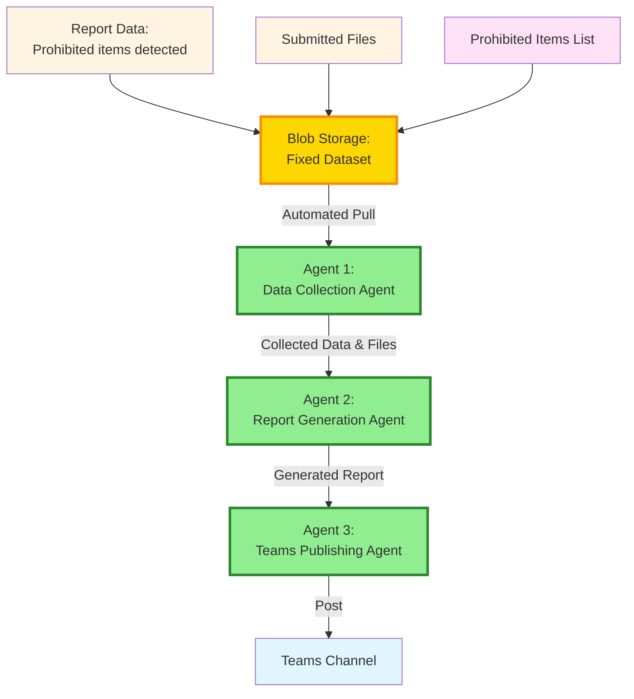

# Agentic Quality Validation and Reporting Framework

## Rationale

### Current Challenge

Organisations use automated systems to detect prohibited items in submitted files for compliance and security. To ensure the detection system is working correctly, a quality assurance process monitors its outputs daily. Currently, this QA process involves multiple manual steps: extracting daily reports from Power BI showing items flagged by the system, manually retrieving the corresponding files from Blob Storage, cross-referencing everything against the prohibited items list to verify accuracy, generating detailed validation reports, and finally publishing findings to a Teams channel for review.

This is a temporary quality check process to validate that the automated detection system is performing as expected.

### Why Automate This Workflow?

This manual process presents several critical challenges:

**Time-Intensive Operations**
- Daily manual extraction from Power BI reports consumes significant staff time
- Manual file retrieval from Blob Storage is repetitive and error-prone
- Cross-referencing files with prohibited items lists requires careful attention and is labour-intensive

**Consistency and Accuracy Concerns**
- Manual processes are susceptible to human error
- Inconsistent report formatting and potential for missed items
- Variable quality depending on operator workload and fatigue

**Scalability Limitations**
- Process doesn't scale well with increasing data volume
- Manual steps create bottlenecks that delay reporting
- Difficult to handle peak periods or urgent requests

**Operational Efficiency**
- Staff time could be better utilised for analysis rather than data collection
- Delays in report publication affect decision-making timelines
- No ability to run on-demand or outside business hours

### Expected Benefits of Automation

**Improved Efficiency**
- Reduce processing time from hours to minutes
- Enable 24/7 automated operation without human intervention
- Free up staff for higher-value analytical work

**Enhanced Accuracy**
- Eliminate human error in data extraction and cross-referencing
- Ensure consistent application of prohibited items rules
- Standardised report formatting and completeness

**Better Timeliness**
- Automatic daily execution ensures reports are always current
- Potential for real-time or near-real-time reporting
- Immediate notification to stakeholders via Teams

**Scalability and Flexibility**
- Easily handle increased data volumes without additional resources
- Simple to modify rules or add new prohibited items
- Foundation for future enhancements and integrations

### Why a Generative AI Solution?

Whilst automation could theoretically be achieved through traditional coded solutions, the nature of the submitted files makes a GenAI-based approach significantly more practical and maintainable.

**The Challenge of Unstructured Data**

Submitted files have no standardised format for representing their data. Each file may structure information differently—varying layouts, inconsistent field names, diverse data arrangements, and unpredictable formatting. A traditional coded solution would require bespoke parsing logic for each unique file format, resulting in:

- Extensive development time to handle each variation
- Brittle code that breaks when new formats are encountered
- Continuous maintenance as file structures evolve
- Limited scalability as the variety of formats increases

**The GenAI Advantage**

A GenAI solution leverages the reasoning capabilities of Large Language Models (LLMs) to:

- **Infer data location** based on context and simple rules rather than rigid parsing logic
- **Adapt to variations** in file structure without requiring code changes
- **Handle ambiguity** through natural language understanding
- **Generalise across formats** using learned patterns rather than explicit programming
- **Reduce maintenance burden** by eliminating format-specific parsing code

By using GenAI, the system can intelligently interpret the content of diverse file formats, making inferences about where relevant data is located and what it represents. This approach provides the flexibility needed to handle the inherent variability in submitted files whilst maintaining accuracy and reliability.

---

## Overview

### Proposed Solution

To address these challenges, this document outlines the transformation of the manual workflow into an automated system using a multi-agent architecture. The solution implements specialized agents that handle distinct phases of the process: data collection, report generation, and publication.

### Proof of Concept Approach

The proof of concept (POC) uses a simplified three-agent system working in sequence:

1. **Data Collection Agent** - Retrieves report data, submitted files, and prohibited items list from Blob Storage
2. **Report Generation Agent** - Analyses and cross-references data to generate detailed findings
3. **Teams Publishing Agent** - Automatically distributes reports to designated Teams channels

To validate the agent workflow without integration complexity, the POC uses a fixed dataset stored entirely in Blob Storage. This approach allows us to prove the concept and refine the agent coordination before connecting to live data sources like PostgreSQL and Power BI.

---

## Original Manual Workflow

The following diagram illustrates the current manual process for detecting and reporting prohibited items:

### Workflow Steps

1. **Data Ingestion**: Application pushes data to PostgreSQL server
2. **Reporting**: PostgreSQL data is pulled into Power BI report
3. **Manual Extraction**: Daily manual extraction of report showing prohibited items detected the previous day
4. **File Retrieval**: Manual extraction of corresponding submitted files from Blob Storage
5. **Cross-Reference**: Manual cross-referencing of files and reports with prohibited items list to generate detailed report
6. **Publication**: Manual publishing of report to Teams channel

**Note**: Steps highlighted in red indicate manual intervention points that could be automated with custom agents.

---

## Proof of Concept: Multi-Agent Automation (Simplified)

The following diagram shows the simplified POC using custom agents with a fixed dataset:

### POC Architecture: Three-Agent System

#### **Agent 1: Data Collection Agent**
- **Purpose**: Automate data and file retrieval from Blob Storage
- **Responsibilities**:
  - Pull report data (prohibited items detected) from Blob Storage
  - Retrieve corresponding submitted files from Blob Storage
  - Retrieve prohibited items list from Blob Storage
  - Consolidate all data for processing

#### **Agent 2: Report Generation Agent**
- **Purpose**: Analyse and generate detailed reports
- **Responsibilities**:
  - Cross-reference report data with submitted files
  - Match detected items against prohibited items list
  - Generate formatted detailed report with findings and analysis

#### **Agent 3: Teams Publishing Agent**
- **Purpose**: Automate report distribution
- **Responsibilities**:
  - Format report for Teams channel presentation
  - Post report to designated Teams channel
  - Include relevant metadata and timestamps

### POC Simplifications

- **Fixed Dataset**: All data pre-loaded in Blob Storage (no live data feeds)
- **Single Source**: Blob Storage contains report data, files, and prohibited items list
- **No Integration Complexity**: Bypasses PostgreSQL, Power BI, and multiple storage systems
- **Focus on Agents**: Tests agent coordination and automation without infrastructure dependencies

### Key Benefits of Simplified POC

- **Faster Development**: No need to set up database or BI connections
- **Easier Testing**: Fixed dataset ensures consistent, reproducible results
- **Clear Validation**: Focus on agent functionality rather than data integration
- **Lower Complexity**: Simpler architecture for proof of concept phase
- **Iterative Approach**: Can add complexity after validating core agent workflow

**Note**: Agents highlighted in green represent the automated custom agents.

---

## Recommended Technology Solution

### Microsoft 365 Copilot Custom Engine Agents

Given the requirements for this automation workflow, **Microsoft 365 Copilot custom engine agents** represent the most suitable technology approach, particularly due to their native integration with Microsoft Teams and the Microsoft 365 ecosystem.

### Why Not Declarative Agents?

Whilst Microsoft 365 Copilot supports declarative agents, they are limited to single-task operations and are prone to hallucination when handling complex, multi-step workflows. Our use case requires:

- Sequential coordination between multiple agents
- Complex data processing and cross-referencing operations
- Reliable execution across multiple stages (collection, analysis, publication)

These requirements exceed the capabilities of declarative agents, making **custom engine agents** the appropriate choice for this solution.

### Recommended Approach: Copilot Studio

Amongst the available options for building custom engine agents, **Copilot Studio** emerges as the optimal solution for this proof of concept due to:

**Low-Code Development**
- Simplifies agent creation without extensive coding requirements
- Reduces development time and complexity
- Provides prebuilt templates and connectors for Microsoft 365 services

**Native Integration**
- Seamless connection to Teams for automated report publishing
- Built-in access to Microsoft 365 and Copilot connector content
- Integrated compliance via Power Platform

**Managed Infrastructure**
- Fully managed SaaS platform eliminates hosting concerns
- Built-in governance and security features
- Simplified deployment and maintenance

**Rapid Prototyping**
- Ideal for proof of concept development
- Quick iteration and testing capabilities
- Lower barrier to entry for demonstration and validation

### Alternative Approaches

For comparison, the Microsoft documentation provides a comprehensive overview of development tool options:

| **Approach** | **Best For** | **Complexity** |
|---|---|---|
| **Copilot Studio** (Recommended) | Rapid development, low-code solutions, Teams integration | Low |
| **Microsoft 365 Agents SDK** | Multi-channel deployment, custom orchestration requirements | High |
| **Teams SDK** | Teams-specific collaborative scenarios | Medium |
| **Microsoft Foundry** | Existing AI logic in Foundry requiring Microsoft 365 integration | Medium-High |

For detailed comparison and technical specifications, refer to the [Microsoft 365 Custom Engine Agent documentation](https://learn.microsoft.com/en-us/microsoft-365-copilot/extensibility/overview-custom-engine-agent#agent-development-tool-comparison).

### Implementation Path

For this proof of concept, Copilot Studio provides the most efficient path to demonstrating the feasibility of the multi-agent automation workflow whilst maintaining integration with Teams and compliance with organisational requirements.
