# Agentic Quality Validation and Reporting Framework

## Table of Contents

- [Background & Context](#background--context)
- [The Evolution of Ineligible Items Validation](#the-evolution-of-ineligible-items-validation)
- [The Ineligible Items Validation Challenge](#the-ineligible-items-validation-challenge)
- [Why This POC Matters](#why-this-poc-matters)
- [Original Manual Workflow](#original-manual-workflow)
- [Why Automate This Workflow?](#why-automate-this-workflow)
- [Expected Benefits of Automation](#expected-benefits-of-automation)
- [Why a Generative AI Solution?](#why-a-generative-ai-solution)
- [Possible Technology Approaches](#possible-technology-approaches)
- [Recommended Technology Solution](#recommended-technology-solution)
  - [Why Microsoft 365 Copilot Custom Engine Agents?](#why-microsoft-365-copilot-custom-engine-agents)
  - [Hybrid Approach: Copilot Studio + Power Automate](#hybrid-approach-copilot-studio--power-automate)
- [Proof of Concept: Hybrid Automation Architecture](#proof-of-concept-hybrid-automation-architecture)
  - [Proof of Concept Approach](#proof-of-concept-approach)
  - [POC Design Decisions](#poc-design-decisions)
  - [Architecture Diagram](#architecture-diagram)
  - [Data Files Reference](#data-files-reference)
  - [Detailed Workflow Steps](#detailed-workflow-steps)
  - [Key Benefits of Hybrid Approach](#key-benefits-of-hybrid-approach)
  - [Monitoring and Observability](#monitoring-and-observability)
  - [POC Result Example](#poc-result-example)
- [Conclusion](#conclusion)

---

## Background & Context

**The Packing List Parser (PLP)** is a critical application within the UK's trade compliance infrastructure. It serves a specific purpose in the Northern Ireland Retail Movement Scheme (NIRMS), which facilitates the movement of goods from Great Britain to Northern Ireland.

### The Business Process

When traders submit requests for general certificates to move goods to Northern Ireland under the NIRMS scheme, they must include packing lists detailing their shipment contents. The PLP application:

- **Parses** submitted packing lists to extract structured data (items, quantities, commodity codes, countries of origin, treatments)
- **Validates** the extracted information against multiple compliance rules and regulations
- **Flags** potential issues that require review before certificate approval

### The Critical 15-Minute Window

Once a certificate request is submitted, there is a **15-minute review window** before the submission is auto-approved. During this time-sensitive period, caseworkers perform manual checks on flagged items to ensure compliance before certificates are issued.

This tight timeframe makes the accuracy and reliability of PLP's automated validations absolutely critical to the business process.

---

## The Evolution of Ineligible Items Validation

The following timeline illustrates how ineligible items validation evolved from a manual process to a fully automated system, and why this POC became necessary:

```mermaid
flowchart LR
    A["⏮️ PHASE 1<br/>Manual Verification<br/><br/>All PLP validations<br/>manually verifiable<br/>by caseworkers"] -->|Complexity<br/>Increased| B["⚙️ PHASE 2<br/>Automation Required<br/><br/>Ineligible items checks<br/>too complex for<br/>15-min window<br/><br/>🔴 First 100%<br/>automated validation"]
    B -->|Trust<br/>Concerns| C["🔍 PHASE 3<br/>Quality Assurance<br/><br/>Manual daily QA<br/>implemented to<br/>validate PLP accuracy<br/><br/>1-2 hours/day"]
    C -->|Confidence<br/>Achieved| D["✅ PHASE 4<br/>Trust Established<br/><br/>Manual QA discontinued<br/>Caseworkers now<br/>trust PLP outputs"]
    D -->|Looking<br/>Back| E["💡 PHASE 5<br/>This POC<br/><br/>What automation<br/>could have offered<br/>during Phase 3"]
    
    style A fill:#e1f5ff,stroke:#0078d4,stroke-width:2px
    style B fill:#fff4e1,stroke:#ff8c00,stroke-width:3px
    style C fill:#ffe1e1,stroke:#ff6b6b,stroke-width:3px
    style D fill:#e1ffe1,stroke:#228b22,stroke-width:2px
    style E fill:#f5e1ff,stroke:#9370db,stroke-width:3px
```

### Why Phase 2 Was Critical

**The Complexity Challenge**: Ineligible items validation involves cross-referencing each item against a database of **2,038 rules** combining:
- Country of origin (exact match required)
- Commodity codes (prefix matching with hierarchical logic)
- Treatment types (conditional matching with null handling)

With multiple items per packing list and the 15-minute review window, manual verification became impossible. **For the first time, caseworkers were completely relying on automated PLP output without the ability to manually verify results.**

### Why Phase 3 Was Necessary

**The Trust Gap**: When automation replaced manual verification for compliance-critical decisions, the business needed assurance that PLP was performing correctly. This led to implementing manual daily QA checks to:
- Validate PLP's ineligible items detection accuracy
- Build confidence in the automated system
- Identify any systematic errors or edge cases
- Provide audit trail for compliance purposes

This manual QA process consumed **1-2 hours every working day** for several months until trust in the system was established.

---

## The Ineligible Items Validation Challenge

During Phase 3 (the trust-building period), quality assurance teams implemented a manual validation workflow to verify PLP's accuracy. This process involved multiple time-intensive steps:

**Daily Manual Operations:**
- Extracting reports from Power BI showing items flagged by PLP as ineligible
- Manually retrieving the corresponding packing list files from Azure Blob Storage
- Cross-referencing flagged items against the 2,038-rule ineligible items database
- Verifying PLP's detection accuracy (true positives vs. false positives)
- Generating detailed validation reports documenting findings
- Publishing results to Teams channel for stakeholder review

**The Business Impact:**
- **Time-Intensive**: 1-2 hours of manual work every working day
- **Error-Prone**: Manual cross-referencing of complex multi-field rules
- **No Scalability**: Process didn't scale with increasing submission volumes
- **Limited Insights**: Simple pass/fail validation without trend analysis
- **Resource Drain**: Highly skilled personnel performing repetitive tasks

While this manual validation successfully built trust in PLP (leading to its discontinuation in Phase 4), it represented a significant operational cost that could have been avoided with automation.

---

## Why This POC Matters

This proof of concept demonstrates how **low-code agentic automation** could have transformed the Phase 3 quality assurance process, and provides a foundation for future compliance intelligence capabilities.

### Primary Value: Time Savings During Trust-Building Period

| **Manual Approach (Phase 3)** | **This POC's Automation** | **Impact** |
|-------------------------------|---------------------------|------------|
| 1-2 hours per day | <1 minute per day | **99%+ time reduction** |
| 5-10 hours per week | Fully automated | **~100 hours saved over 3-month period** |
| Manual data extraction | Automated data retrieval | Eliminated human error |
| Inconsistent reporting | Standardized output | Improved reliability |
| Business hours only | 24/7 scheduled execution | Always current |

### Secondary Value: Gen AI-Driven Intelligence

Beyond simple automation, this POC showcases capabilities impossible with traditional Power Automate alone:

✅ **Trend Analysis**: 5-day historical comparison identifying increasing/decreasing violation patterns  
✅ **Pattern Recognition**: Automatic detection of repeat offenders across multiple days  
✅ **Anomaly Detection**: Flagging unusual spikes or new violation categories  
✅ **Actionable Recommendations**: Prioritized action items based on trends and context  
✅ **Natural Language Insights**: Human-readable executive summaries with business context  

### Future Value: Foundation for Ongoing Compliance Intelligence

While Phase 3 validation is no longer needed (trust established), this architecture provides a foundation for:

- **Proactive Monitoring**: Early detection of PLP performance degradation
- **Parser Model Comparison**: Quality analysis across different parser versions
- **Compliance Trend Tracking**: Long-term pattern analysis for policy refinement
- **Automated Reporting**: Stakeholder visibility without manual intervention

### Why Low-Code Agentic Solutions?

**Speed to Value**
- Rapid development and iteration without extensive coding
- Proof of concept delivered in days/weeks vs. months
- Easy to modify and extend as requirements evolve

**Native Microsoft 365 Integration**
- Seamless Teams integration for stakeholder communication
- Azure Blob Storage connectivity out-of-the-box
- Application Insights monitoring with zero configuration

**Generative AI Capabilities**
- Contextual analysis beyond rule-based automation
- Natural language generation for stakeholder-ready reports
- Intelligent insights that scale with data complexity

**Accessibility**
- Power Platform governance and security built-in
- No specialized infrastructure or hosting requirements
- Maintainable by business analysts, not just developers

---

## Original Manual Workflow

The following diagram illustrates the manual QA process that was implemented during Phase 3 to validate PLP's ineligible items detection:

### Workflow Steps

1. **Data Ingestion**: Application pushes data to PostgreSQL server
2. **Reporting**: PostgreSQL data is pulled into Power BI report
3. **Manual Extraction**: Daily manual extraction of report showing ineligible items detected the previous day
4. **File Retrieval**: Manual extraction of corresponding submitted files from Azure Blob Storage
5. **Cross-Reference**: Manual cross-referencing of files and reports with ineligible items list to generate detailed report
6. **Publication**: Manual publishing of report to Teams channel

**Note**: Steps highlighted in red indicate manual intervention points that could be automated with custom agents.

---

## Why Automate This Workflow?

This manual process presents several critical challenges:

**Time-Intensive Operations**  
- Daily manual extraction from Power BI reports consumes significant staff time  
- Manual file retrieval from Azure Blob Storage is repetitive and error-prone  
- Cross-referencing files with ineligible items lists requires careful attention and is labour-intensive  
- On average, this process takes **1–2 hours every working day**, representing a recurring operational cost

**Consistency and Accuracy Concerns**  
- Manual processes are susceptible to human error  
- Inconsistent report formatting and potential for missed items  
- Variable quality depending on operator workload and fatigue

**Scalability Limitations**  
- Process doesn't scale well with increasing data volume  
- Manual steps create bottlenecks that delay reporting  
- Difficult to handle peak periods or urgent requests

**Operational Efficiency**  
- Staff time could be better utilised for analysis rather than data collection  
- Delays in report publication affect decision-making timelines  
- No ability to run on-demand or outside business hours

**Business Impact**  
Automating this workflow would free approximately **5–10 hours of staff time per week**, improve operational resilience by reducing dependency on specific individuals, and deliver a fast return on investment by removing repetitive manual effort from highly skilled personnel.

---

## Expected Benefits of Automation

**Improved Efficiency**
- Reduce processing time from hours to minutes
- Enable 24/7 automated operation without human intervention
- Free up staff for higher-value analytical work

**Enhanced Accuracy**
- Eliminate human error in data extraction and cross-referencing
- Ensure consistent application of ineligible items rules
- Standardised report formatting and completeness

**Better Timeliness**
- Automatic daily execution ensures reports are always current
- Potential for real-time or near-real-time reporting
- Immediate notification to stakeholders via Teams

**Scalability and Flexibility**
- Easily handle increased data volumes without additional resources
- Simple to modify rules or add new ineligible items
- Foundation for future enhancements and integrations

---

## Why a Generative AI Solution?

This workflow is well-suited to a generative AI approach because it involves processing unstructured compliance data and generating human-readable reports with contextual explanations. Traditional rule-based automation would require extensive hard-coded logic for:

- **Interpreting validation results** and determining appropriate report formatting based on findings
- **Generating natural language explanations** for each compliance violation or clearance
- **Adapting report structure** dynamically based on the number and type of violations found
- **Producing professional HTML formatting** with proper styling and visual indicators

The LLM's natural language generation capabilities enable the solution to create reports that are not only accurate but also clear and actionable for human reviewers. The generative AI component handles the intelligent formatting and explanation tasks, while structured Power Automate flows handle the data validation logic - creating an optimal division of responsibilities.

---

## Possible Technology Approaches

For comparison, the Microsoft documentation provides a comprehensive overview of development tool options:

| **Approach** | **Best For** | **Complexity** |
|---|---|---|
| **Copilot Studio** (Recommended) | Rapid development, low-code solutions, Teams integration | Low |
| **Microsoft 365 Agents SDK** | Multi-channel deployment, custom orchestration requirements | High |
| **Teams SDK** | Teams-specific collaborative scenarios | Medium |
| **Microsoft Foundry** | Existing AI logic in Foundry requiring Microsoft 365 integration | Medium-High |

For detailed comparison and technical specifications, refer to the [Microsoft 365 Custom Engine Agent documentation](https://learn.microsoft.com/en-us/microsoft-365-copilot/extensibility/overview-custom-engine-agent#agent-development-tool-comparison).

---

## Recommended Technology Solution

### Why Microsoft 365 Copilot Custom Engine Agents?

Given the requirements for this automation workflow, **Microsoft 365 Copilot custom engine agents** represent the most suitable technology approach, particularly due to their native integration with Microsoft Teams and the Microsoft 365 ecosystem.

**Why Not Declarative Agents?**

Whilst Microsoft 365 Copilot supports declarative agents, they are limited to simple conversational scenarios and lack the orchestration capabilities needed for this workflow. Our use case requires:

- **Sequential orchestration** of multiple Power Automate flows with data passing between stages
- **Complex data processing** involving filtering, validation, and cross-referencing operations
- **Reliable execution** across multiple stages (data collection, validation, report generation, publication)
- **Integration** with custom prompts for AI-driven report formatting

Declarative agents cannot orchestrate multi-step workflows or invoke Power Automate flows, making **custom engine agents built in Copilot Studio** the appropriate choice for this solution.

### Hybrid Approach: Copilot Studio + Power Automate

For this proof of concept, a **hybrid approach using Copilot Studio and Power Automate** provides the optimal solution:

**Copilot Studio for AI Tasks**
- Custom prompts for natural language parsing and report generation
- Leverages LLM capabilities for unstructured text processing
- Ideal for formatting and generating human-readable content

**Power Automate for Structured Operations**
- Reliable data filtering and matching operations
- Complex business logic for validation rules
- Native Azure Blob Storage integration
- Teams posting and workflow orchestration

**Low-Code Development**
- Simplifies solution development without extensive coding requirements
- Reduces development time and complexity
- Provides prebuilt connectors for Microsoft 365 services

**Native Integration**
- Seamless connection to Teams for automated report publishing
- Built-in access to Azure storage and Microsoft 365 services
- Integrated compliance via Power Platform

**Managed Infrastructure**
- Fully managed SaaS platform eliminates hosting concerns
- Built-in governance and security features
- Simplified deployment and maintenance

**Rapid Prototyping**
- Ideal for proof of concept development
- Quick iteration and testing capabilities
- Lower barrier to entry for demonstration and validation

**Key Learning**: During development, we discovered that Copilot Studio's generative answer nodes with knowledge sources are unsuitable for structured database queries (they use semantic search, not structured matching). This led to the hybrid architecture where Power Automate handles all structured data operations reliably, while custom prompts focus on AI-driven text processing and formatting tasks.

---

## Proof of Concept: Hybrid Automation Architecture

### Proof of Concept Approach

The proof of concept (POC) uses a hybrid architecture combining Power Automate flows and Copilot Studio custom prompts:

1. **Daily Trigger** - Power Automate scheduled flow triggers daily at 8AM, invoking the Copilot Agent with the prompt "performs automated daily compliance validation of packing lists against ineligible items regulations"
2. **Data Filtering** - Power Automate flow retrieves packing lists with ineligible item failures from Azure Blob Storage
3. **Item Filtering** - Power Automate flow filters items list to those from flagged applications with failure indicators
4. **Validation** - Power Automate flow validates filtered items against the ineligible items database
5. **Historical Data Management** - Power Automate flow saves today's validation result to Blob Storage and retrieves the last 5 days for trend analysis
6. **Report Formatting** - Custom prompt analyzes historical trends and generates formatted HTML report with insights, metrics, parser model tracking, and detailed findings
7. **Teams Publishing** - Power Automate posts the report to a Teams channel

To validate the workflow without integration complexity, the POC uses mock data representing real production data structures. The packing list and items list data structures mirror the actual output from the production packing list parser system, augmented with relevant test data to demonstrate ineligible item detection scenarios.

**Architecture Choice**: This solution uses Power Automate flows for structured data operations (filtering, matching, validation) and Copilot Studio custom prompts for AI-driven tasks (parsing natural language, generating formatted reports), avoiding the limitations discovered with Copilot Studio's generative answer nodes for structured data queries.

### POC Design Decisions

- **Mock Dataset**: Uses JSON files representing real production data structures from the packing list parser system
- **Data Structures**: Packing lists and items lists mirror actual production schemas, augmented with test scenarios
- **Data Validation**: Items with failure indicators verified against ineligible items database to ensure data integrity
- **Single Source**: All data stored in Azure Blob Storage for simplified POC testing
- **Hybrid Architecture**: Power Automate for structured operations, custom prompts for AI-driven tasks
- **No Live Integration**: Bypasses PostgreSQL and Power BI to focus on workflow automation
- **Validation Rules**: Implements actual business logic (exact country match, commodity prefix match, conditional treatment matching)
- **Parser Model Tracking**: Report includes parser model for each application to enable quality analysis across different parsers
- **Historical Trend Analysis**: Includes 4 days of pre-generated historical validation results (Jan 1-4, 2026 submissions) to demonstrate Gen AI's ability to identify patterns, trends, and actionable insights beyond templated formatting

### Architecture Diagram

The following diagram shows the POC architecture combining Power Automate flows and custom prompts:

### Data Files Reference

**Note**: The workflow is initiated daily at 8AM by a scheduled Power Automate flow that triggers the Copilot Agent with the prompt: "performs automated daily compliance validation of packing lists against ineligible items regulations". The agent's instructions point to the 'Automated Daily Validation' prompt, which orchestrates the following data flows:

| File | Stage | Description | Sample |
|------|-------|-------------|--------|
| **packing_list_mock_data.json** | Input Data | Packing lists with submission metadata, parser models, and failure reasons | [View sample](data/input/packing_list_mock_data.json) |
| **items_list_mock_data.json** | Input Data | Individual items extracted from packing lists with commodity codes and treatments | [View sample](data/input/items_list_mock_data.json) |
| **data-ineligible-items.json** | Input Data | Ineligible items database with 2038 rules (country, commodity code, treatment combinations) | [View sample](data/input/data-ineligible-items.json) |
| **validationResult-2026-01-01.json** | Historical Data | Validation results from Jan 1, 2026 submissions | [View sample](data/input/historical/validationResult-2026-01-01.json) |
| **validationResult-2026-01-02.json** | Historical Data | Validation results from Jan 2, 2026 submissions | [View sample](data/input/historical/validationResult-2026-01-02.json) |
| **validationResult-2026-01-03.json** | Historical Data | Validation results from Jan 3, 2026 submissions | [View sample](data/input/historical/validationResult-2026-01-03.json) |
| **validationResult-2026-01-04.json** | Historical Data | Validation results from Jan 4, 2026 submissions | [View sample](data/input/historical/validationResult-2026-01-04.json) |
| **packingListData.json** | Flow 1 Output | Flagged applications with parser models (7 applications with ineligible item failures) | [View sample](data/results/packingListData.json) |
| **matchedItems.json** | Flow 2 Output | Filtered items from flagged applications with failure indicators | [View sample](data/results/matchedItems.json) |
| **validationResult.json** | Flow 3 Output | Validation results from Jan 5, 2026 submissions (validated on Jan 6, 2026) | [View sample](data/results/validationResult.json) |
| **historicalResults.json** | Flow 4 Output | Array of 5 validation result objects: 4 historical days (Jan 1-4, 2026) + today's result (Jan 5, 2026) for trend analysis | [View sample](data/results/historicalResults.json) |
| **validationReport.html** | Custom Prompt Output | Formatted HTML compliance report with trend analysis, parser model tracking, and detailed findings | [View sample](data/results/validationReport.html) |

### Detailed Workflow Steps

#### **Flow 0: Daily Trigger and Agent Invocation**
- **Type**: Power Automate Scheduled Flow
- **Purpose**: Automatically initiate the compliance validation workflow daily
- **Schedule**: Every day at 8:00 AM
- **Operations**:
  - **Trigger Execution**: Scheduled flow triggers at 8:00 AM
  - **Agent Invocation**: Flow invokes Copilot Agent with the prompt: "performs automated daily compliance validation of packing lists against ineligible items regulations"
  - **Agent Processing**: Agent receives the prompt and evaluates its instructions
  - **Topic Selection**: Agent instructions explicitly route to the 'Automated Daily Validation' topic
  - **Workflow Orchestration**: The 'Automated Daily Validation' topic executes its contained flows (Flows 1-4) and custom prompt sequentially
  - **Data Flow**: Topic coordinates data passing between flows and manages the end-to-end workflow execution

#### **Flow 1: Filter Packing Lists**
- **Type**: Power Automate Flow
- **Purpose**: Identify packing lists with ineligible item failures
- **Input**: [packing_list_mock_data.json](data/input/packing_list_mock_data.json)
- **Output**: [packingListData.json](data/results/packingListData.json)
- **Operations**:
  - Filter by submission date
  - Filter by allRequiredFieldsPresent = false
  - Filter by reasonsForFailure contains "Ineligible item identified"
  - Extract applicationId and parserModel for each flagged application

#### **Flow 2: Filter Items**
- **Type**: Power Automate Flow
- **Purpose**: Filter items list to those from flagged applications with failure indicators
- **Inputs**: 
  - [packingListData.json](data/results/packingListData.json) (from Flow 1)
  - [items_list_mock_data.json](data/input/items_list_mock_data.json)
- **Output**: [matchedItems.json](data/results/matchedItems.json)
- **Operations**:
  - Select applicationIds from Flow 1 output
  - Filter items where packingListId is in applicationIds array
  - Filter items where failure field contains "Ineligible item identified"
  - Return complete item records for validation

#### **Flow 3: Validate Items**
- **Type**: Power Automate Flow
- **Purpose**: Validate items against ineligible items database
- **Inputs**:
  - [matchedItems.json](data/results/matchedItems.json) (from Flow 2)
  - [data-ineligible-items.json](data/input/data-ineligible-items.json)
- **Output**: [validationResult.json](data/results/validationResult.json)
- **Operations**:
  - Exact match on country of origin
  - Prefix match on commodity code
  - Conditional match on treatment type (null handling)
  - Return isProhibited flag and matched rule details

#### **Flow 4: Save and Retrieve Historical Data**
- **Type**: Power Automate Flow
- **Purpose**: Persist today's validation result and collect last 5 days for trend analysis
- **Input**: [validationResult.json](data/results/validationResult.json) (from Flow 3)
- **Output**: [historicalResults.json](data/results/historicalResults.json) - Array of 5 objects, each containing reportDate and validationResults (4 historical days Jan 1-4 + today Jan 5)
- **Operations**:
  - Get current date in YYYY-MM-DD format
  - Save validation result to Azure Blob Storage as `validationResult-YYYY-MM-DD.json`
  - List files matching pattern `validationResult-2026-01-*.json`
  - Sort by LastModified date and take last 5 files (4 historical + today's saved result)
  - Loop through each file: retrieve content, parse JSON, compose object with reportDate and validationResults
  - Append each composed object to historicalResults array
  - Return structured array for trend analysis by custom prompt

#### **Custom Prompt: Analyse Trends & Format Report**
- **Type**: Copilot Studio Custom Prompt ('Automated Daily Validation')
- **Purpose**: Analyse historical trends and generate formatted compliance report with actionable insights
- **Inputs**:
  - reportDate: Date for the report (2026-01-05)
  - historicalResults: Array of 5 validation results from Flow 4 - 4 historical days (Jan 1-4, 2026) + today's result (Jan 5, 2026) as last item
  - [packingListData.json](data/results/packingListData.json) (from Flow 1) - for parser model mapping
- **Output**: [validationReport.html](data/results/validationReport.html)
- **Operations**:
  - **Trend Analysis**: Compare today's violations against 5-day historical data to identify increasing/decreasing patterns
  - **Pattern Recognition**: Detect repeat offenders (same shipper IDs appearing multiple days)
  - **Anomaly Detection**: Flag unusual spikes or new violation categories
  - **Actionable Recommendations**: Generate prioritized action items based on trends
  - Calculate summary metrics (Total Ineligible Items Found, Total Ineligible Items Cleared, Total Applications with Ineligible Items, Total Applications Cleared of Ineligible Items)
  - Extract unique parser models with ineligible items from packingListData
  - Map parserModel to each application in the report
  - Group items by Application ID
  - Format as HTML for Teams with executive summary, trend insights, parser model column, and detailed findings
  - Highlight cleared items in red ("No match found")
  - Include detailed findings with matched rules for auditability

#### **Flow 5: Post to Teams**
- **Type**: Power Automate Flow
- **Purpose**: Publish report to Teams channel
- **Input**: [validationReport.html](data/results/validationReport.html) (from Custom Prompt)
- **Operations**:
  - Post HTML message to Teams channel
  - Include date and validation run timestamp

### Key Benefits of Hybrid Approach

- **Clear Separation**: Structured data operations in flows, AI tasks in prompts
- **Simplified Workflow**: Direct item filtering eliminates intermediate parsing step
- **Reliability**: Avoided Copilot Studio limitations with generative answer nodes for structured queries
- **Transparency**: Each validation includes matched rule details for auditability
- **Quality Analysis**: Parser model tracking enables performance comparison across different parsers
- **Visual Clarity**: Red highlighting of cleared items improves report readability
- **Scalability**: Flow logic handles null values, multiple items per application, edge cases
- **Data Integrity**: Systematic validation ensures all flagged items match ineligible items rules
- **Testability**: Fixed dataset ensures consistent results for validation
- **Intelligent Insights**: Gen AI analyzes 5-day trends to identify patterns, repeat offenders, anomalies, and actionable recommendations beyond templated formatting
- **Historical Context**: Data persistence enables trend tracking and demonstrates production-ready architecture
- **Value Demonstration**: Trend analysis showcases Gen AI's unique capability for contextual reasoning vs. pure Power Automate templated reports
- **Historical Context**: Data persistence enables trend tracking and demonstrates production-ready architecture
- **Value Demonstration**: Trend analysis showcases Gen AI's unique capability for contextual reasoning vs. pure Power Automate templated reports

**Note**: Pink box represents the scheduled trigger, purple box represents the Copilot Agent, blue boxes represent Power Automate flows (structured operations), green boxes represent Copilot Studio custom prompts (AI-driven tasks), light blue box represents Application Insights monitoring.

### Monitoring and Observability

The POC solution includes comprehensive monitoring through **Azure Application Insights**, which captures detailed telemetry for every execution of the automated workflow.

#### What Gets Monitored

**Event Types Captured:**
- `BotMessageReceived` - Incoming trigger messages and prompts
- `TopicStart/TopicEnd` - Topic execution lifecycle tracking
- `TopicAction` - Individual actions within topics (InvokeFlowAction, InvokeAIBuilderModelAction, SetVariable, EndDialog)
- `dependency` - Flow executions with duration metrics and success/failure status
- `trace` - Detailed flow invocation information
- `pageView` - Topic navigation and routing

**Key Metrics Tracked:**
- **Execution Duration**: Performance metrics for each flow and overall topic execution
- **Success Rate**: Success/failure status for all operations
- **Performance Buckets**: Categorized response times (e.g., "<250ms", "500ms-1sec", "1sec-3sec")
- **Conversation Context**: Conversation IDs, session IDs for end-to-end tracing
- **Custom Dimensions**: TopicName, ActionId, FlowId, channelId for detailed filtering

#### Sample Performance Data

From a typical daily execution at 8AM:

| Flow | Duration | Performance Bucket |
|------|----------|--------------------|
| Flow 1: Filter Packing Lists | 611ms | 500ms-1sec |
| Flow 2: Filter Items | 542ms | 500ms-1sec |
| Flow 3: Validate Items | 3,858ms | 3sec-7sec |
| Flow 4: Save & Retrieve Historical Data | 2,300ms | 1sec-3sec |
| Flow 5: Post to Teams | 2,875ms | 1sec-3sec |
| **Total Topic Execution** | **~10-15 seconds** | **End-to-end** |

#### Application Insights Data

For reference, a complete Application Insights export showing the detailed telemetry for one execution is available here: [application-insights-logs.csv](data/results/application-insights-logs.csv)

The following screenshot shows the Application Insights query interface in Azure Portal displaying the same telemetry data:

**Benefits of Application Insights Integration:**
- **Automated Monitoring**: Captures telemetry for every scheduled 8AM execution without manual intervention
- **Performance Analysis**: Identify bottlenecks and optimize slow-running flows
- **Reliability Tracking**: Monitor success rates and quickly identify failures
- **Troubleshooting**: Full conversation traces enable rapid root cause analysis
- **Historical Analysis**: Long-term data retention for trend analysis and capacity planning
- **Alerting**: Configure alerts for failures or performance degradation

### POC Result Example

The following screenshot shows the actual output posted to Teams channel by the automated workflow:

The report includes:
- **Report Header**: Date and emoji for visual identification
- **Trend Insights Section** (NEW): AI-generated analysis of 5-day historical data showing violation trends, repeat offenders, anomalies, and prioritized action items
- **Executive Summary**: Key metrics (Total Ineligible Items Found, Total Ineligible Items Cleared, Total Applications with Ineligible Items, Total Applications Cleared of Ineligible Items, Parser Models with Ineligible Items)
- **Detailed Findings Table**: Application ID, Parser Model, and complete feedback for each item
- **Parser Model Tracking**: Shows which parser flagged each application for quality analysis
- **Visual Enhancements**: Cleared items highlighted in red ("No match found") for visibility
- **Matched Rules**: Transparency showing which database entry triggered each ineligible item identification

**Automation**: This report is automatically generated and posted every day at 8AM by the scheduled Power Automate trigger invoking the Copilot Agent.

---

## Conclusion

This proof of concept successfully demonstrates how **low-code agentic automation** using Microsoft 365 Copilot custom engine agents and Power Automate can transform compliance quality assurance workflows.

### What We've Demonstrated

**Technical Feasibility**
- Hybrid architecture combining Power Automate flows for structured operations with Copilot Studio custom prompts for AI-driven intelligence
- Seamless integration with existing Microsoft 365 ecosystem (Teams, Azure Blob Storage, Application Insights)
- Production-ready monitoring and observability with zero infrastructure overhead

**Business Value**
- **99%+ time reduction**: From 1-2 hours of manual work (average 90 minutes) to <1 minute of automated execution daily
- **~100 hours saved**: Average 7.5 hours/week over 13 working weeks during the 3-month Phase 3 trust-building period
- **Enhanced insights**: Gen AI-powered trend analysis, pattern recognition, and actionable recommendations impossible with traditional automation

**Strategic Foundation**
- Architecture extends beyond retrospective validation to enable proactive compliance intelligence
- Parser model tracking enables quality comparison across different ML models
- Historical data persistence supports long-term trend analysis and policy refinement

### Key Takeaways

✅ **Speed to Value**: Low-code approach delivered working POC in days, not months  
✅ **Accessible Technology**: Maintainable by business analysts without specialized development skills  
✅ **Gen AI Differentiation**: LLM capabilities provide contextual insights beyond rule-based automation  
✅ **Enterprise Ready**: Built-in governance, security, and compliance via Power Platform  
✅ **Extensible Design**: Foundation for future enhancements and similar compliance workflows  

### Looking Forward

While the Phase 3 manual QA process has been successfully discontinued due to established trust in PLP, this architecture demonstrates:

**Immediate Applications**
- Template for automating similar compliance validation workflows
- Foundation for proactive monitoring of PLP performance degradation
- Enabler for stakeholder visibility without manual reporting overhead

**Future Opportunities**
- Real-time compliance alerts for urgent violations
- Advanced analytics for policy optimization and risk assessment
- Cross-system integration for end-to-end trade compliance automation
- AI-driven anomaly detection for fraud prevention

### The Low-Code Agentic Advantage

This POC validates that **Microsoft 365 Copilot custom engine agents** represent a compelling solution for compliance automation scenarios requiring:
- Time-sensitive processing and reporting
- Integration with existing Microsoft 365 infrastructure  
- Natural language generation for stakeholder communication
- Rapid development cycles with minimal technical debt
- Governance and security alignment with enterprise standards

By combining the orchestration power of Power Automate with the intelligent reasoning of generative AI, organizations can build sophisticated automation solutions that deliver both operational efficiency and strategic intelligence.
